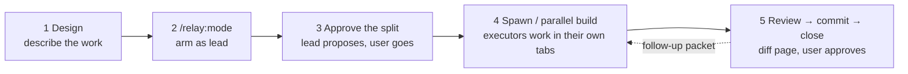
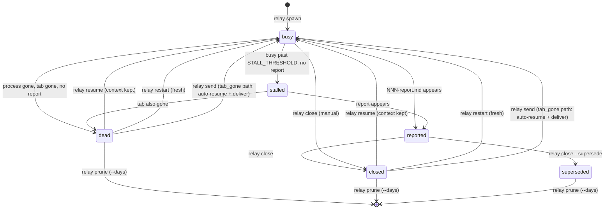
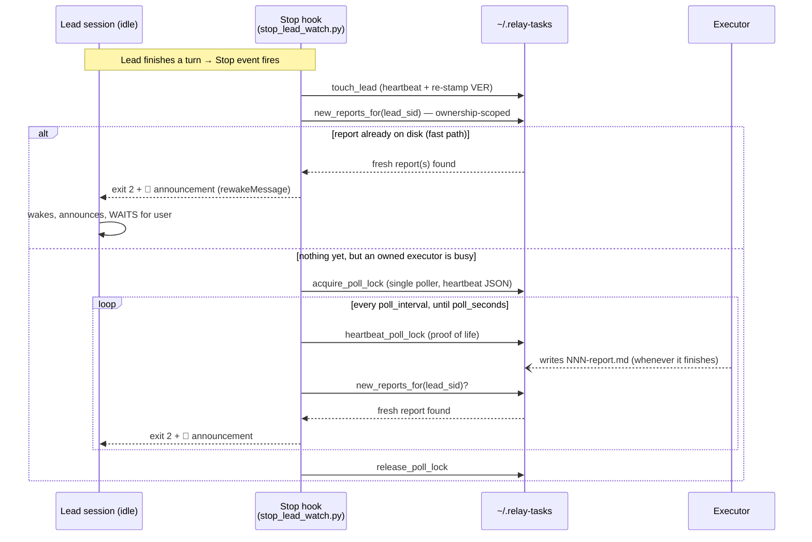

# How relay works

The companion to the [README](../README.md): diagrams and mechanism depth for anyone (human or
agent) who needs the mental model fast, and needs it to match the code as it is *today*. Where the
README already words something well, this doc links to it rather than restating it.

## 1. The mental model

relay turns one Claude Code session into a **lead** — it plans, delegates, and reviews, but never
implements large work itself — and spawns **executor** sessions in their own terminal tabs, each
seeded with a **packet** (a work-order `.md` file). An executor stages its work (never commits),
writes a **report** when done, and stays idle for reuse. The lead reviews the staged diff, commits,
and closes (or reuses) the executor. The user is in the loop at two gates: approving the split
before anything spawns, and reviewing each report before it's committed. See the README's
[Mental model](../README.md#mental-model) for the five beats in prose and the three nouns
(session/packet/report) in full.



All of this lives under one state root, `~/.relay-tasks/`:

```
~/.relay-tasks/
├── sessions.jsonl              durable ledger — every event, forever (prune never touches it)
├── lead/config.json            settings (see the README's Config table)
├── lead/<lead-sid>/            marker.json, poll.lock, surfaced_reports.json, last_head, pid
└── <executor-sid>/             session.json, worktree pointer
    └── packets/
        ├── 001-packet.md       what the lead sent
        ├── 001-report.md       what the executor wrote back
        └── 001-diff.html       relay diff's rendered staged-diff page
```

## 2. A session's life

An executor session is a state machine tracked in `~/.relay-tasks/<sid>/session.json`, recomputed
by `_check_one` (`bin/relay:799`) whenever `relay check`/`relay list`/`relay send` touches it —
`relay status` is the exception; it only *reads* stored state (see [§5](#5-health-surfaces)).



- **`resume`** (`cmd_resume`, `bin/relay:659`) reopens the *same* Claude conversation via `claude
  --resume <claude_session>` — full context and staged work intact. Writes ledger event
  `resumed`.
- **`restart`** (`cmd_restart`, `bin/relay:565`) re-runs the session's current packet as a brand
  new conversation (fresh `session_uuid`) — loses prior context. Writes `restarted`.
- **`send` into a closed/dead session** (`cmd_send`, `bin/relay:685`) is the "tab_gone" path: if
  the target has no live tab but a captured `claude_session`, it kills any lingering process,
  closes the stale tab, then resumes the conversation *and* delivers the new packet in one shot —
  no separate `relay resume` step needed. Writes `packet_sent` with `via="resume"`. If there's no
  captured `claude_session` at all (pre session-id-capture spawns), it marks the session `dead`
  instead and tells you to `relay spawn` fresh.
- Every one of these transition points also runs **adopt-on-claim** (`_maybe_adopt`,
  `bin/relay:535`) before doing anything else — see [§3](#3-the-wake-path-the-deep-one).
- **`prune --days N`** (`cmd_prune`, `bin/relay:1365`) is the only thing that erases terminal-state
  session dirs (and stale lead markers); it never touches `sessions.jsonl`, the durable ledger.

Status is recomputed, not pushed: `_check_one` (`bin/relay:799`) prefers the report file's
existence over anything else (a written report always means `reported`, regardless of process
state), falls to `stalled` when the process is alive but has been `busy` too long
(`STALL_THRESHOLD_SECONDS`) or when the process died but its tab is still open, and only reaches
`dead` when both the process *and* the tab are gone with no report. `relay send`/`relay list`
always re-run this before deciding anything, so a session that finished after your last check
never reads as falsely busy.

Ledger events written along these transitions: `spawned`, `packet_sent`, `resumed`, `restarted`,
`reported`, `stalled`, `closed`, `superseded`, `adopted`, `pruned`, `lead_pruned`. Lead-side events
from §4 (`lead_started`, `blocked`, `retained`, `lead_handoff`, `lead_stepped_down`,
`handoff_nudged`, `session_end`) share the same `sessions.jsonl` file — one flat, append-only
history across every lead and executor on the machine.

## 3. The wake path (the deep one)

The lead is turn-based, not a daemon — after delegating, it needs to *learn* an executor finished
without the user asking, without blocking a turn, and without a `/loop` re-fire. relay uses a
`Stop` hook with Claude Code's `asyncRewake` (background execution; exit `2` wakes the idle
session) — see `docs/async-rewake-findings.md` for the spike that proved this works. The
implementation is `hooks/stop_lead_watch.py`, and it covers two halves: a synchronous fast path,
and a background poller for reports that land later.



**Ownership scoping.** `new_reports_for` (`lib/lead_guard.py:533`) and `has_inflight_executors`
(`lib/lead_guard.py:602`) both filter by `owner_lead == lead_sid` — a lead never wakes for another
lead's executors, or gets stuck polling for one. This is deliberate (otherwise every stale unowned
report on the machine would spam every new lead), but it means ownership has to be re-parented
correctly whenever a *different* lead starts acting on an inherited executor. The fix is
**adopt-on-claim**: `_maybe_adopt` (`bin/relay:535`) runs inside `send`/`resume`/`restart`, and
re-parents `owner_lead` to the calling lead whenever the current owner is `None` or no longer alive
(`_lead_alive`, `bin/relay:510` — checked via recorded pid, then iTerm tty resolution). A **live**
owner is never silently stolen from — the caller gets a warning and must run `relay adopt <sid>
--force` to take it explicitly. `relay adopt` (`cmd_adopt`, `bin/relay:768`) exposes this same
logic standalone, for claiming an inherited executor up front without sending it anything. This
re-parenting rule exists because a real incident proved its absence costly — see
`wake-bug-ownership-2026-07-11.md`.

**Single-poller lock with heartbeat.** Only one background poller may run per lead
(`acquire_poll_lock`, `lib/lead_guard.py:730`), stored as `poll.lock` — a JSON blob `{pid,
pid_started, ts}`. Every poll tick refreshes `ts` (`heartbeat_poll_lock`). Staleness
(`_poll_lock_status`, `lib/lead_guard.py:663`) is a triple test, any one of which condemns the
lock: the recorded pid is dead; the pid is alive but its process-start-time no longer matches
`pid_started` (the OS recycled that exact pid number for an unrelated process, so a liveness check
on the pid alone can be fooled); or the heartbeat `ts` is older than `max(3 × poll_interval, 30)`
seconds (the holder stopped ticking, whoever it is — sufficient on its own, independent of pid
checks). `relay list`'s `WAKE` column surfaces a stale lock as `stuck` (distinct from `stale`/`ok`)
via `poll_lock_state` (`lib/lead_guard.py:720`), using the exact same staleness test
`acquire_poll_lock` uses — list and acquire can never disagree on what counts as dead. This
staleness rule exists because a real incident proved its absence costly — see
`wake-bug-stale-poll-lock-2026-07-11.md`.

## 4. The lead lifecycle

Five steps, in order — no branching, no thresholds to track in a diagram; those live in the prose
under each step instead.

1. **Arm** (`cmd_lead_start`, `bin/relay:1427`) — `/relay:mode` writes `lead/<sid>/marker.json`
   (project, cwd, tab_label, per-lead color, `plugin_version` + `stop_hook_timeout` captured from
   `${CLAUDE_PLUGIN_ROOT}` *right now*), and records the repo's current git `HEAD` as the baseline
   for commit-surfacing (`lead_guard.write_head`). Idempotent — re-running `/relay:mode` just
   refreshes the marker.
2. **Work happens through the gate** (`hooks/pretool_route_guard.py`) — blocks a single
   `Edit`/`Write`/`MultiEdit` that adds ≥ `edit_line_threshold` (default 40) new lines, or creates a
   new file when `block_on_new_file` is set, *before* it lands. It deliberately does **not** gate
   `Bash` (`git commit`, `sed -i`, heredocs pass ungated — see [§7](#7-honest-limits)), and packet
   files (`*-packet.md`, or anything under `~/.relay-tasks`) are exempt, since writing them is the
   lead's own job. `/relay:route retain "<reason>"` (`cmd_route`, `bin/relay:1559`) opens a
   `grace_seconds` (default 120s) window where edits pass through untouched — logged as one
   `retained` ledger event. Every block is logged too (`blocked` event, with
   file/line-count/new-file fields).
3. **Session gets heavy** — `relay status --statusline`'s lead view carries a transcript-weight
   segment (`_weight_segment`, `bin/relay:900`) once the transcript passes 60% of
   `handoff_nudge_mb` — ambient, informational, no action taken. Separately, `stop_lead_watch.py`
   fires a **one-shot** 🔁 nudge (flag-filed via `mark_handoff_nudged` so it can never repeat) the
   first time the transcript crosses the full `handoff_nudge_mb` threshold (default 5MB — see the
   README's [`handoff_nudge_mb`](../README.md#config) row for calibration notes).
4. **`/relay:handoff <handoff.md>`** (`cmd_handoff`, `bin/relay:1486`) — writes the successor's
   marker (pinned `session_uuid`) *before* spawning its tab, so gate + auto-wake are live from the
   successor's very first turn — no `/relay:mode` needed. Only after the spawn call returns
   successfully does the caller step down (`lead_guard.clear_lead`) — a failed spawn leaves the
   caller as lead and drops the pre-written successor marker, so the project is **never leadless,
   never left with a ghost**.
5. **Successor leads, pre-armed** — inherited executors don't need any explicit re-wiring: the
   successor's first `send`/`resume` into one adopts it automatically (§3). Its seed prompt is a
   short pointer at a relay-owned copy of the handoff file (`build_handoff_copy`), with a SUCCESSOR
   AFTERCARE section appended — the user's source md is untouched, and the launch prompt stays a
   one-liner (a prior revision inlined the aftercare directly and truncated a real launch command).
   Once settled, the successor runs `/relay:mode` to VERIFY arming (idempotent if the pin held); the
   predecessor's tab is recorded in the successor's marker and closed, on user approval, via `relay
   close-predecessor`.

**The abnormal path.** A lead whose tab crashed or was closed without `/relay:stop` leaves a marker
behind with no live process — `sessionend_lead_cleanup.py` only clears lead state on documented
real-end reasons (`clear`, `logout`, `prompt_input_exit`, `exit`; anything else, e.g. plugin-reload
churn, preserves the marker — see the SessionEnd-safety addendum in
`docs/async-rewake-findings.md`). `relay prune` (`cmd_prune`, `bin/relay:1365`) is what actually
removes stale ghosts, and does so under a **triple guard**, none of which may be weakened: never the
calling lead itself, a liveness probe (`_lead_alive`), and a staleness window (`last_active` older
than `--days`). Wrongly pruning a live lead unarms its gate and wakes — worse than a stale row
lingering — so this is intentionally more conservative than executor adoption's
fail-toward-adoptable default.

## 5. Health surfaces

| Surface | What it looks like | What it means | Fix |
|---|---|---|---|
| `relay list` `VER` | plugin version string, or `?` | which relay version this lead is armed under (`plugin_version` in its marker, re-stamped every heartbeat from the *live* hook's plugin root — `touch_lead`, `lib/lead_guard.py:325`) | usually nothing; mismatched-looking VER across leads is expected after a plugin update until each re-arms |
| `relay list` `WAKE = ok` | green `ok` | `stop_hook_timeout` stamped at arm time is ≥ `poll_seconds` — the harness won't kill the poller before it can catch a late report (`wake_hook_state`, `lib/lead_guard.py:285`) | nothing to do |
| `WAKE = stale` | red `STALE` | stamped timeout is missing or below `poll_seconds` — a pre-fix hook that WILL miss late reports | `/plugin update relay@claude-relay` → `/reload-plugins` → re-run `/relay:mode` to re-arm (re-stamps) |
| `WAKE = ver?` | dim `ver?` | marker predates version stamping at all — can't prove safety either way | re-run `/relay:mode`; `/reload-plugins` first if it predates your last update |
| `WAKE = stuck` | red `stuck` | poll lock is stale (dead/recycled pid, or heartbeat gone quiet) — a dead watcher is blocking wakes right now (`poll_lock_state`, overrides `ok`/`stale`) | nothing manual needed — self-heals on the lead's next turn (`acquire_poll_lock` auto-breaks a stale lock); a landed report surfaces then |
| orphan footnote (`relay list`) | `⚠ N executor(s) owned by retired leads` | an executor's `owner_lead` marker no longer exists — wake is dead for it until claimed | `relay adopt <sid>`, or just `relay send`/`resume` (adopt automatically) |
| stale-hooks footnote (`relay list`) | red `⚠ stale hooks: <project>, ...` | a lead active within the last 6h whose stamped `VER` parses LOWER than the installed plugin version — current hooks re-stamp on every turn, so a recent-but-stale stamp proves `/reload-plugins` did not re-point that session's hooks (`_version_tuple`, `bin/relay:132`) | restart that session — a manual `/relay:mode` re-stamp only hides the warning (it also blinds this same check) |
| `relay status` lead view | `🚦 busy: tk-parser,tk-render · ✅ tk-auth · 4.2MB` | busy-executor NAMES (not a bare count — live-usage feedback: "1 busy" doesn't say who), reported-executor names (report-file existence, read-only), optional `WAKE stuck`/`WAKE stale` segment, transcript-weight segment (`--statusline` only) | see the matching WAKE row above; `4.2MB → /relay:handoff` once past threshold |
| `relay status` executor view | `🚦 pkt 003 busy · for webapp` | this executor's current packet + state, and its owning lead's project name | check the lead's tab for overall progress |
| desktop notification | iTerm OSC banner (native click→session) → terminal-notifier (`-execute relay focus`, coalesces per lead) → osascript (`display notification`, not clickable) | three tiers, first one that applies wins — see the README's [Auto-wake and notifications](../README.md#auto-wake-and-notifications) for the full breakdown | `notify_via: "terminal-notifier"` in config skips tier 1 for a clean, relay-set title/subtitle |

## 6. Name resolution

Every sid-accepting relay command routes through `resolve_sid` (`bin/relay:1622`, wired centrally
in `main()`'s `RESOLVE_FIELDS` loop), so anywhere a raw session id was required you can instead
type an executor's **name** (its id, set via `spawn --name`), a lead's **project name**, or any
**unique prefix (≥ 6 chars)** of either's id. Precedence, first hit wins: exact executor session
id → exact lead session id → exact lead project-name match → unique id prefix → no match (token
returned unchanged, so a raw sid that already worked keeps working). Ambiguity (a project name or
prefix matching more than one session — e.g. an old + new lead of the same project after a
handoff) is never guessed: the command exits listing every candidate sid, newest-first, with enough
context (project + version, or topic) to tell them apart (`_sid_candidates_message`,
`bin/relay:1599`).

## 7. Honest limits

- **`Bash` is ungated.** The routing gate only sees `Edit`/`Write`/`MultiEdit`; `git commit`, `sed
  -i`, and heredoc-written files pass through untouched. That discipline stays on the lead — see
  the README's [routing gate](../README.md#the-routing-gate-friction-not-trust) section.
- **`relay status` has no liveness refresh.** It's deliberately read-only (no `write_session`, no
  `append_ledger`, no `_check_one`) so it's safe on every statusline render — a crashed executor
  can still read `busy` there until `relay list`/`relay check` actually re-checks it.
- **A watcher that dies mid-idle can't rearm itself until the lead's next turn.** The poll lock
  self-heals (§3), but only when something calls `acquire_poll_lock` again — that happens on the
  lead's next `Stop` event, i.e. its next turn. A report landing in between surfaces as soon as
  that turn happens, not instantly.
- **Transcript size is a proxy, not context occupancy.** Compaction shrinks the model's actual
  context but the transcript file keeps growing — `handoff_nudge_mb` measures session weight, not
  how full the context window is.
- **The lead's self-model-check is unreliable after repeated `/model` switches** within one
  session — decide the model once, then arm, per `skills/mode/SKILL.md`.
